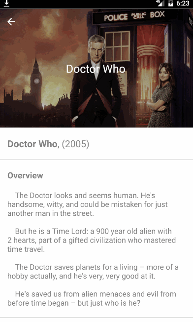
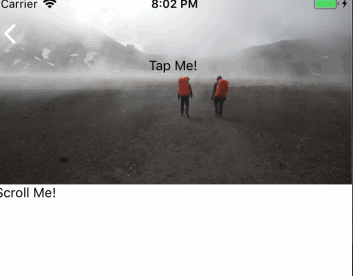
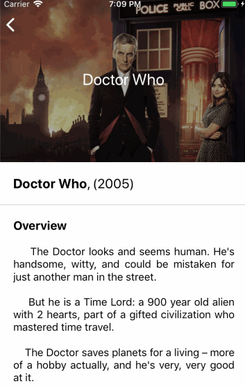

# react-native-image-header-scroll-view


A ScrollView-like component that:
 - Has a fixed image header
 - Keep the image as a nav bar
 - Works on iOS and Android

## Breaking changes

### Version 1.0.0
**/!\ Warning /!\\**
The lib has been upgraded to match with new React and React Native standards (hooks, deprecated methods, etc...).
The version 1.0.0 may contain some bugs or regressions. Ping me in issues if you notice a bad behaviour of the upgraded lib on your project.
I advice you to update the lib in a separate commit to roll back if necessary.
However the lib should work for most of cases, so don't be scared to update the lib.
**It is a first step to improve the lib in the future, so please be understanding 😇**

## Installation

```
$ npm install react-native-image-header-scroll-view --save
```

## Demo

|

You can find this example code here : https://github.com/bamlab/react-native-image-header-scroll-view-example/blob/master/src/Pages/TvShow.js 

## Basic Usage 

```jsx
import HeaderImageScrollView, { TriggeringView } from 'react-native-image-header-scroll-view';

// Inside of a component's render() method:
render() {
  return (
    <HeaderImageScrollView
      maxHeight={200}
      minHeight={MIN_HEIGHT}
      headerImage={require("../../assets/NZ.jpg")}
      renderForeground={() => (
        <View style={{ height: 150, justifyContent: "center", alignItems: "center" }} >
          <TouchableOpacity onPress={() => console.log("tap!!")}>
            <Text style={{ backgroundColor: "transparent" }}>Tap Me!</Text>
          </TouchableOpacity>
        </View>
      )}
    >
      <View style={{ height: 1000 }}>
        <TriggeringView onHide={() => console.log("text hidden")}>
          <Text>Scroll Me!</Text>
        </TriggeringView>
      </View>
    </HeaderImageScrollView>
  );
}
```

Result : 




You can find examples in a [dedicated repository](https://github.com/bamlab/react-native-image-header-scroll-view-example).

## Usage (API)

All of the properties of `ScrollView` are supported. Please refer to the
[`ScrollView` documentation](https://facebook.github.io/react-native/docs/scrollview.html) for more detail.

The `HeaderImageScrollView` handle also the following props. None is required :

### Header

| Property | Type | Default | Description | Example |
| -------- | ---- | ------- | ----------- | ------- |
| `renderHeader` | `function` | Empty view | Function which return the component to use as header. It can return background image for example. | [example](https://github.com/bamlab/react-native-image-header-scroll-view-example/blob/3b9d2d0d7f71c6bf877e2d10cc65c9ab7e1b484d/src/Pages/PullToRefresh.js#L37) |
| `headerImage` | Image source Props (object or number) | `undefined` | Shortcut for `renderHeader={() => <Image source={this.props.headerImage} style={{ height: this.props.maxHeight, width: Dimensions.get('window').width }} />}` | [example](https://github.com/bamlab/react-native-image-header-scroll-view-example/blob/master/src/Pages/BasicUsage.js#L26) |
| `maxHeight` | `number` | `80` | Max height for the header | [example](https://github.com/bamlab/react-native-image-header-scroll-view-example/blob/master/src/Pages/BasicUsage.js#L24) |
| `minHeight` | `number` | `125` | Min height for the header (in navbar mode) | [example](https://github.com/bamlab/react-native-image-header-scroll-view-example/blob/master/src/Pages/BasicUsage.js#L24) |
| `minOverlayOpacity` | `number` | `0` | Opacity of a black overlay on the header before any scroll | [example](https://github.com/bamlab/react-native-image-header-scroll-view-example/blob/3b9d2d0d7f71c6bf877e2d10cc65c9ab7e1b484d/src/Pages/TvShow.js#L96) |
| `maxOverlayOpacity` | `number` | `0.3` | Opacity of a black overlay on the header when in navbar mode | [example](https://github.com/bamlab/react-native-image-header-scroll-view-example/blob/3b9d2d0d7f71c6bf877e2d10cc65c9ab7e1b484d/src/Pages/TvShow.js#L96) |
| `overlayColor` | `string` | `black` | Color of the overlay on the header | [example](https://github.com/bamlab/react-native-image-header-scroll-view-example/blob/master/src/Pages/Colors.js#L16) |
| `useNativeDriver` | `boolean` | `false` | Use native driver for the animation for performance improvement. A few props are unsupported at the moment if `useNativeDriver=true` (`onScroll`, `ScrollComponent`, `renderTouchableFixedForeground`) | - |
|`headerContainerStyle`|`Object`|`undefined`| Optional styles to be passed to the container of the header component|
|`disableHeaderGrow`|`boolean`|`undefined`| Disable to grow effect on the header|

### Foreground

| Property | Type | Default | Description | Example |
| -------- | ---- | ------- | ----------- | ------- |
| `renderForeground` | `function` | Empty view | Function which return the component to use at foreground. The component is render in front of the header and scroll with the ScrollView. It can return a title for example.| [example](https://github.com/bamlab/react-native-image-header-scroll-view-example/blob/master/src/Pages/TvShow.js#L112) |
| `renderFixedForeground` | `function` | Empty view | Function which return the component to use as fixed foreground. The component is displayed with the header but not affected by the overlay.| [example](https://github.com/bamlab/react-native-image-header-scroll-view-example/blob/3b9d2d0d7f71c6bf877e2d10cc65c9ab7e1b484d/src/Pages/TvShow.js#L100) |
| `foregroundExtrapolate` | `string` | `clamp` | Optional prop that allows override extrapolate mode for foreground. Use `null` to allow extrapolation, which is usefull for using foreground as bottom title | - |
| `foregroundParallaxRatio` | `number` | `1` | Ration for parallax effect of foreground when scrolling. If 2, the header goes up two times faster than the scroll | [example](https://github.com/bamlab/react-native-image-header-scroll-view-example/blob/master/src/Pages/Colors.js#L23) |
| `fadeOutForeground` | `bool` | `false` | If set, add a fade out effect on the foreground when scroll up | [example](https://github.com/bamlab/react-native-image-header-scroll-view-example/blob/master/src/Pages/Colors.js#L13) |
| `renderTouchableFixedForeground` | `function` | Empty view | Same as `renderFixedForeground` but allow to use touchable in it. [*Can cause performances issues on Android*](https://github.com/bamlab/react-native-image-header-scroll-view/issues/6)| [example](https://github.com/bamlab/react-native-image-header-scroll-view-example/blob/master/src/Pages/PullToRefresh.js#L45) |
|`fixedForegroundContainerStyles`|`Object`|`undefined`| Optional styles to be passed to the container of the fixed foreground component|

### Mixed

| Property | Type | Default | Description | Example |
| -------- | ---- | ------- | ----------- | ------- |
| `ScrollViewComponent` | `Component` | `ScrollView` | The component to be used for scrolling. Can be any component with an `onScroll` props (ie. `ListView`, `FlatList`, `SectionList` or `ScrollView`) | [example](https://github.com/bamlab/react-native-image-header-scroll-view-example/blob/master/src/Pages/Avignon.js#L34) |
| `scrollViewBackgroundColor` | `string` | `white` | Background color of the scrollView content | [example](https://github.com/bamlab/react-native-image-header-scroll-view-example/blob/master/src/Pages/PullToRefresh.js#L52) |


### TriggeringView

The module also export a TriggeringView component. It is a spy View you put on the page that will can call various callback during the scroll.
It accept callback called when it disappear or appear at the top of the ImageHeaderScrollView. You can see [an exemple in the dedicated repository](https://github.com/bamlab/react-native-image-header-scroll-view-example).

All of the properties of `View` are supported.


| Property | Type | Description |
| -------- | ---- | ----------- |
| `onBeginHidden` | `function` | Called when the component start to be hidden at the top of the scroll view. |
| `onHide` | `function` | Called when the component is not displayed any more after scroll up |
| `onBeginDisplayed` | `function` | Called when the component begin to be displayed again after scroll down |
| `onDisplay` | `function` | Called when the component finished to be displayed again. |
| `onTouchTop` | `function` | Called when the Top of the component touch the Top of the ScrollView. (`onDisplay` + `onBeginHidden`) |
| `onTouchBottom` | `function` | Called when the Bottom of the component touch the Top of the ScrollView. (`onHide` + `onBeginDisplayed`) |


## FAQ

### How to remove the black image overlay

Just set the `maxOverlayOpacity` to `0`.

```jsx 
<HeaderImageScrollView
  minOverlayOpacity={0}
  maxOverlayOpacity={0}
  {/* ... */}
/>

```

### How to remove the image zomming on scroll down

You have two solutions : 

1. You can use the `disableHeaderGrow` props. It will keep the ios elastic scroll effect.
2. You can also use the `bounces={false}` props [from the scroll view](https://facebook.github.io/react-native/docs/scrollview#bounces). 

Results : 

| `disableHeaderGrow` | `bounces={false}` | 
| ------------------- | ----------------- | 
|


## Contributing

All contributions are welcomed, that might be either adding new features, doing some refaco of the exisiting code or fixing bugs. 

**How to contribute**

1. Fork the project & clone locally. Follow the initial setup here.
2. Create a branch, naming it either a feature or bug: git checkout -b feature/that-new-feature or bug/fixing-that-bug
3. Code and commit your changes. Write a good commit message. Best would be to use git [commitizen](https://github.com/commitizen/cz-cli)
4. Test your changes in the example
  - launch the Expo project: `cd example && yarn start && cd ..`
  - compile typescript to lib folder : `yarn tsc --noEmit``
  - watch your feature/fix in your simulator
5. Push to the branch: git push origin feature/that-new-feature
6. Create a pull request for your branch 🎉


## Other open-source modules by the folks at [BAM](http://github.com/bamlab)

 * [generator-rn-toolbox](https://github.com/bamlab/generator-rn-toolbox)
 * [react-native-image-resizer](https://github.com/bamlab/react-native-image-resizer)
 * [react-native-numberpicker-dialog](https://github.com/bamlab/react-native-numberpicker-dialog)
 * [react-native-animated-picker](https://github.com/bamlab/react-native-animated-picker)
